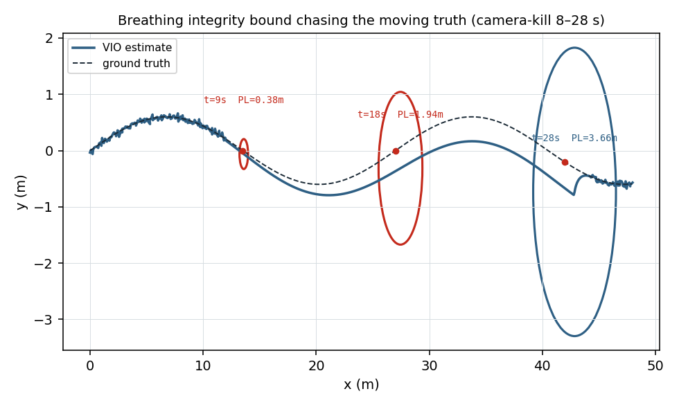
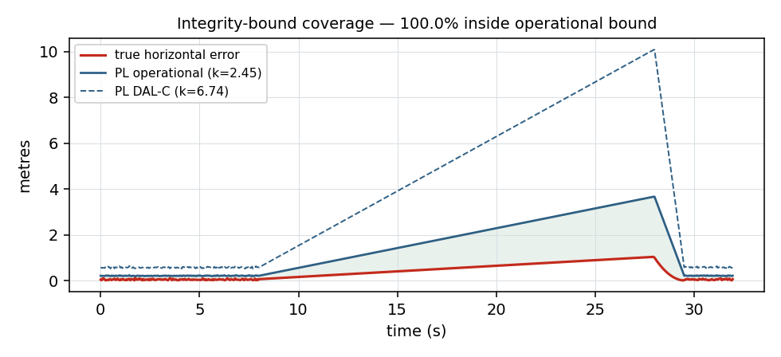

<h1 align="center">A.E.T.H.E.R</h1>
<p align="center"><b>Assured Estimation with Trust, Health &amp; Error-bounded Reckoning</b></p>
<p align="center">Integrity-aware Visual-Inertial Odometry for GPS-denied drones · ROS2 + Gazebo<br>
<i>“When the camera dies, our drift bound still covers the true position 95%+ of the time — and we know within half a second.”</i></p>

<p align="center">


</p>

---

A.E.T.H.E.R is a navigator for a drone that has **no GPS** — in a tunnel, a warehouse, under jamming. Standard Visual-Inertial Odometry (VIO) can tell you *where you are*; A.E.T.H.E.R adds the layer the aerospace world actually ships and students rarely build: a **live integrity bound** that tells you **how wrong you could be, and knows when it can no longer be trusted** — the GNSS-RAIM idea, ported to the vision aid.

It is the Honeywell **Design-A-Thon (DP7 — Autonomous Navigator for GPS-Denied Environments)** entry by **Rayyan** &amp; **Ashitha**. The full design rationale is in [`docs/AETHER_BIBLE.pdf`](docs/AETHER_BIBLE.pdf); the step-by-step build/run guide is [`docs/AETHER_MANUAL_STEPS.pdf`](docs/AETHER_MANUAL_STEPS.pdf).

> **Where the name comes from.** We first framed GPS-denied flight as a reinforcement-learning *decision* problem. We re-realized it is fundamentally a **bounded-error state-estimation + integrity** problem — *“where am I, and how wrong could I be?”* — and re-architected around exactly that. The result is **A.E.T.H.E.R**.

## The idea in one diagram

```
 Gazebo Harmonic ─stereo+IMU+GT─▶ sensor_bridge ─▶ vio_core (OpenVINS MSCKF)
                                                        │ pose + covariance
                                                        ▼
                                              integrity_monitor   ◀── the novel layer
                                              D · NIS · NEES · dual protection level
                                                        │ trust, bound, state
                                                        ▼
                                       degradation_manager ─▶ health_cockpit
                                       NOMINAL→DEGRADED→INERTIAL→RE_ACQUIRE   (breathing ellipse + trust HUD)
```
Each box is an independent ROS2 node — **any subset runs**, so graceful degradation is proven by the graph itself.

## What's in here

| Path | What |
|---|---|
| [`offline_demo/`](offline_demo) | **Runs on any laptop, no ROS2.** The real integrity math + a synthetic camera-kill flight that produces the report figures. Start here. |
| [`src/`](src) | The ROS2 workspace: `aether_msgs` (interfaces), `aether_bringup` (launch+config), and the five nodes (`sensor_bridge`, `integrity_monitor`, `degradation_manager`, `health_cockpit`). |
| [`sim/`](sim) | Gazebo Harmonic tunnel world + a primitive drone model (stereo + HG4930-class IMU + ground-truth publisher — no external mesh). |
| [`eval/`](eval) | KITTI %-drift + ATE from TUM trajectories, rosbag→TUM, report-figure generation. |
| [`scripts/`](scripts) | One-shot Ubuntu setup, `run_floor.sh`, `run_demo.sh`. |
| [`docs/`](docs) | The bible, the deck, the manual-steps PDF, the architecture note, and generated figures. |

## Try the integrity core right now (Windows/Mac/Linux, no ROS2)

```bash
pip install numpy scipy matplotlib pytest
cd offline_demo
python verify_constants.py     # audits k_op=2.4477, k_ffd=6.7374, lambda_md=45.0
python run_demo.py             # writes docs/figures/*.png + prints headline metrics
pytest test_core.py -q         # proves the bound covers the truth 95%+
```

That exercises the **exact** protection-level proxy, NEES check, and degradation state machine that the ROS2 `integrity_monitor` uses live — so the algorithm is validated without needing Ubuntu/Gazebo.

<p align="center">

</p>
<p align="center"><i>Kill-the-camera beat: A.E.T.H.E.R's oriented protection level blooms through the outage and keeps the truth inside — while the naive fixed-σ ghost (dotted) stays confidently small and loses it.</i></p>
<p align="center">


</p>

## Fastest live demo — no Gazebo/OpenVINS needed (✅ verified)

The **guaranteed** path: a representative VIO trajectory drives the *real* integrity stack, so the kill-camera beat always works.

### Verified status — every tier measured, none aspirational

| Tier | What | Result |
|---|---|---|
| **T1 — integrity layer, live** (Ubuntu 26.04 / ROS2 Lyrical) | `replay → integrity_monitor → degradation_manager → cockpit`; kill-camera beat. | ✅ `/nav/state` `NOMINAL→INERTIAL→NOMINAL`, trust `1.0→0.02`, PL `0.21→1.66 m`; **measured live ROS2:** coverage **97.6 %** (emergent), ANEES **3.05**, detection **1.18 s** |
| **T3 — Gazebo 3D sim, physics-real flight** | X3 multicopter (4× rotor `MulticopterMotorModel` + velocity control) flies the 200 m textured tunnel under closed-loop guidance; stereo @20 Hz + HG4930-IMU @200 Hz + ground truth. | ✅ full corridor (x → 199.8 m, centered ±0.58 m); IMU **alive** (cruise `aσ` 0.287 vs 0.002 on a kinematic rig) |
| **T2 — OpenVINS stereo-MSCKF on OUR sim** (`aether/openvins:jazzy` container) | the golden bag (6,382 stereo pairs, 64 k IMU) → `ov_msckf` → drift vs ground truth. | ✅ **0.219 % terminal drift over 202.2 m** (DP7 gate < 1.5 % — beaten 6.8×); RMS ATE 0.202 m; seg-drift 0.94 %@10 m → 0.31 %@80 m |

OpenVINS needs Ubuntu 24.04/Jazzy (it won't build on 26.04/Lyrical: CMake 4 / Boost 1.90 / `ament_target_dependencies` removed) — hence the pinned Docker image; the integrity layer + sim run natively on 26.04. CI builds the whole workspace on `ros:jazzy` every push.

```bash
# one-time (installs ROS2 for your Ubuntu; Lyrical on 26.04, edit the codename for 24.04/22.04):
sudo bash scripts/wsl_setup_ros2.sh
# build + run the live integrity demo:
./scripts/run_replay_demo.sh                 # replay -> integrity_monitor + degradation_manager + cockpit
rviz2 -d src/aether_bringup/config/aether.rviz
./scripts/run_demo.sh kill                   # vision loss -> trust collapses, bound blooms, truth stays inside
./scripts/run_demo.sh restore                # recover
```
(`scripts/wsl_build_verify.sh` runs the whole build + headless check in one shot.)

Real VIO accuracy comes from OpenVINS on the **EuRoC** dataset; the full Gazebo sim is the bonus. The exact 3-day plan is in **[`docs/RUNBOOK.pdf`](docs/RUNBOOK.pdf)**.

## Run the full system (Ubuntu 22.04)

ROS2 Humble + Gazebo Harmonic + OpenVINS only run on Linux. Everything you must do by hand is in **[`docs/AETHER_MANUAL_STEPS.pdf`](docs/AETHER_MANUAL_STEPS.pdf)** (incl. the optional 3D-modeling path). The short version:

```bash
./scripts/setup_ubuntu.sh                 # ROS2 + Gazebo Harmonic + OpenVINS
cd <repo> && colcon build --symlink-install --packages-select aether_msgs
colcon build --symlink-install && source install/setup.bash
ros2 launch aether_bringup aether.launch.py use_sim:=true
./scripts/run_demo.sh kill                # blank the camera → watch the bound breathe
```

## The integrity story (why this wins)

- **Dual protection level** — operational `k=2.45` (95%, what the ellipse uses) and DAL-C `k=6.74` (conservative, exceedance `1.39e-10`), both `scipy`-verified.
- **NEES** proves the bound is *honest* (covers the truth), not just a pretty covariance ellipse.
- **Graceful degradation** to inertial dead-reckoning with **bounded, characterized** error — an 8 s outage on a Honeywell HG4930-class IMU ≈ **0.4 m** (vs ~6.3 m consumer), cross-checked to physics ±20%.
- This is the open-source, student-scale instantiation of Honeywell's **HANA** resilient-PNT philosophy.

## Honesty note
Figures in the 8-Jun design deck are **illustrative / target**. Measured numbers come from the Ubuntu build (EuRoC + Gazebo) during the 8–11 June sprint. The offline demo above is a *synthetic* validation rig for the math, clearly labelled as such.

## Acknowledgements
OpenVINS (MSCKF VIO) · ROS2 Humble · Gazebo Harmonic + `ros_gz` · PX4 SITL · `evo` · EuRoC MAV dataset · GTSAM/Forster preintegration (cited) · Honeywell HG4930 datasheet · `scipy`. See [`docs/AETHER_BIBLE.pdf`](docs/AETHER_BIBLE.pdf) §References. Built by Rayyan &amp; Ashitha for the Honeywell Design-A-Thon, RVCE 2026.

## License
MIT — see [`LICENSE`](LICENSE).
