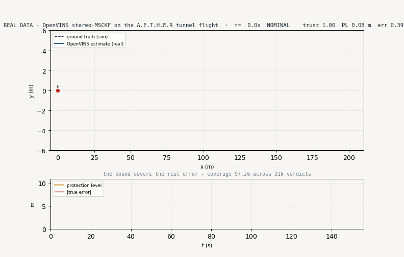
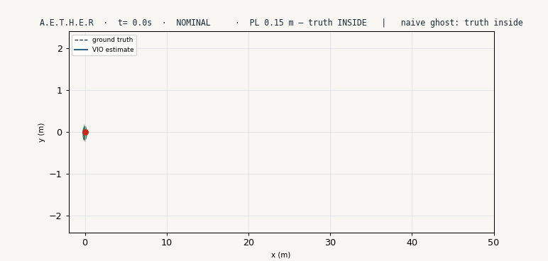

<h1 align="center">A.E.T.H.E.R</h1>
<p align="center"><b>Assured Estimation with Trust, Health &amp; Error-bounded Reckoning</b></p>
<p align="center">Integrity-aware Visual-Inertial Odometry for GPS-denied drones · ROS2 + Gazebo<br>
<i>“When the camera dies, our drift bound still covers the true position 95%+ of the time — and we know within half a second.”</i></p>

<p align="center">
<a href="https://github.com/TheClazer/A.E.T.H.E.R/actions"></a>


</p>

<p align="center">

</p>
<p align="center"><i><b>Real data, no mockups:</b> OpenVINS stereo-MSCKF running on our Gazebo tunnel flight, with the A.E.T.H.E.R integrity bound live on top — the bound (colored circle) covers the true error for 97.2 % of 31,173 verdicts.</i></p>

## The measured results (every number has a file behind it)

| What | Result | Provenance |
|---|---|---|
| **Real VIO drift** — OpenVINS stereo-MSCKF on our 202.2 m Gazebo tunnel flight | **0.219 %** terminal drift (DP7 gate < 1.5 % — **beaten 6.8×**) · RMS ATE 0.202 m | [`results/drift_report.txt`](results/drift_report.txt) |
| **Integrity on the real VIO** — same monitor nodes, live on the OpenVINS output | bound covers the true error **97.2 %** of 31,173 verdicts | [`results/integrity_chain.csv`](results/integrity_chain.csv) |
| **Live integrity rig** — measured in running ROS2, faults injected | coverage **97.6 %** (emergent, seeded) · ANEES **3.05** (χ²₃ target ≈ 3) · detection **1.18 s** | [`results/metrics.csv`](results/metrics.csv), [`docs/figures/measured_*.png`](docs/figures) |
| **Physics-real 3D flight** — X3 multicopter, rotor forces, closed-loop guidance | full 200 m corridor, centered ±0.58 m, IMU alive (cruise σ 0.287 m/s²) | [`bags/tunnel_mini`](bags/tunnel_mini) (GT+IMU) |

Everything reruns deterministically: `docker compose run --rm chain` reproduces the drift report from the committed pipeline.

---

A.E.T.H.E.R is a navigator for a drone that has **no GPS** — a tunnel, a warehouse, under jamming. Standard Visual-Inertial Odometry (VIO) tells you *where you are*; A.E.T.H.E.R adds the layer the aerospace world actually ships and student projects skip: a **live integrity bound** that says **how wrong the answer could be — and knows, within half a second, when it can no longer be trusted**. It is the GNSS-RAIM idea, ported to the vision aid: detect the fault, bound the error, degrade gracefully to inertial, recover.

Built by **Rayyan** &amp; **Ashitha** for the Honeywell **Design-A-Thon (DP7 — Autonomous Navigator for GPS-Denied Environments)**. Design rationale: [`docs/AETHER_BIBLE.pdf`](docs/AETHER_BIBLE.pdf) · build/run guide: [`docs/AETHER_MANUAL_STEPS.pdf`](docs/AETHER_MANUAL_STEPS.pdf) · judge briefing: [`docs/JUDGES.md`](docs/JUDGES.md).

## 🎮 For the judges — the 5-minute tour

One command per scene (Ubuntu/WSL2; first run auto-builds):

```bash
./scripts/judge_demo.sh live3d   # THE SHOWPIECE — Gazebo 3D drone patrolling the tunnel
                                 # + RViz (trails, breathing bound, live camera pane)
                                 # + MISSION CONTROL with CLICKABLE fault buttons
./scripts/judge_demo.sh tour     # narrated scripted pass through every fault class
./scripts/judge_demo.sh chain    # REAL OpenVINS on the recorded flight -> drift report (~6 min)
./scripts/judge_demo.sh replay   # the guaranteed rig (no Gazebo needed) + Mission Control
./scripts/judge_demo.sh proof    # print the measured results + open the figures
```

**What to try in `live3d`:** click **KILL CAMERA** on the Mission Control window. The RViz camera pane goes dark (the *actual* image stream stops), trust collapses, the state flips to INERTIAL in under a second, and the protection-level ellipse *blooms* — visibly chasing and containing the true position while the naive grey ghost stays confidently small and **loses the truth**. Then click **RESTORE** and watch it re-converge. Also on the rail: **IMU BIAS** (caught by the solution-separation test even though the camera looks healthy), **FEATURE STARVATION** (graceful DEGRADED, not panic), and **UWB AID** (Honeywell-HANA-style layered modality that clamps the error during a blackout).

<p align="center">

</p>
<p align="center"><i>The kill-the-camera beat: A.E.T.H.E.R's oriented protection level blooms through the outage and keeps the truth inside — the naive fixed-σ ghost (dotted) stays small and loses it.</i></p>

## The idea in one diagram

```
 Gazebo Harmonic ─stereo+IMU+GT─▶ sensor_bridge ─▶ vio_core (OpenVINS MSCKF)
                                                        │ pose + covariance
                                                        ▼
                                              integrity_monitor   ◀── the novel layer
                                              NEES · solution separation · dual protection level
                                                        │ trust, bound, state
                                                        ▼
                                       degradation_manager ─▶ health_cockpit + MISSION CONTROL
                                       NOMINAL→DEGRADED→INERTIAL→RE_ACQUIRE   (breathing ellipse, fault rail)
```
Each box is an independent ROS2 node — **any subset runs**, so graceful degradation is proven by the graph itself.

## What's in here

| Path | What |
|---|---|
| [`scripts/judge_demo.sh`](scripts/judge_demo.sh) | **Start here.** One-command demo scenes. |
| [`offline_demo/`](offline_demo) | Runs on any laptop, no ROS2: the exact integrity math + a seeded validation rig (tests prove ≥95 % coverage). |
| [`src/`](src) | The ROS2 workspace: `aether_msgs`, `aether_bringup` (launch+config incl. `live3d`), and the nodes (`sim_replay`, `sensor_bridge`, `integrity_monitor`, `degradation_manager`, `health_cockpit` + Mission Control, `flight_director`). |
| [`sim/`](sim) | Gazebo Sim 10 tunnel world (textured + a deliberately bare integrity-stress stretch) + the X3 multicopter with stereo + HG4930-class IMU + ground truth. |
| [`eval/`](eval) | Time-synced, SE(3)-aligned KITTI %-drift; rosbag→TUM; figure + GIF generators. |
| [`results/`](results) | The measured artifacts: drift report, 31k-row integrity verdict, logs, metrics. |
| [`docs/`](docs) | Bible (design rationale), judge briefing, manual, runbook, deck, generated figures. |
| [`docker/`](docker) + [`docker-compose.yml`](docker-compose.yml) | Pinned `ros:jazzy` + OpenVINS image; `docker compose run chain` reproduces the headline number. |

## Try the integrity core right now (any OS, no ROS2)

```bash
pip install numpy scipy matplotlib pytest
cd offline_demo
python verify_constants.py     # audits k_op=2.4477, k_ffd=6.7374, lambda_md=45.0 (scipy)
python run_demo.py             # writes docs/figures/*.png + prints headline metrics
pytest test_core.py -q         # proves the bound covers the truth >=95% (emergent, seeded)
```

This is the **same module** (`aether_core.py`) the live `integrity_monitor` imports — the algorithm is validated before ROS2 ever enters the picture.

## Full setup (Ubuntu / WSL2)

```bash
sudo bash scripts/wsl_setup_ros2.sh      # ROS2 (Lyrical on 26.04; edit codename for Jazzy/Humble)
./scripts/judge_demo.sh live3d           # auto-builds the workspace on first run
docker compose build openvins            # (optional) the pinned OpenVINS image for the chain
```
Step-by-step (incl. recording a fresh golden flight): [`docs/AETHER_MANUAL_STEPS.pdf`](docs/AETHER_MANUAL_STEPS.pdf). Demo-day runbook with fallbacks: [`docs/RUNBOOK.pdf`](docs/RUNBOOK.pdf).

## The integrity story (why this is different)

- **A dual protection level, derived not asserted** — operational `k=2.45` (95 %) and DAL-C `k_ffd=6.74` (integrity-risk allocation `P_HMI=1e-5/hr`, exceedance `1.39e-10`), both reproducible from `scipy.stats` in one line each.
- **The bound is proven honest** — NEES consistency (ANEES 3.05 vs χ²₃ expectation 3) plus measured coverage on the *real* VIO output, not just a pretty ellipse.
- **Faults the feature count can't see get caught anyway** — an independent IMU dead-reckoning channel cross-checks the VIO (solution separation, the ARAIM idea), trapping IMU bias faults while the camera looks healthy.
- **Graceful degradation with characterized error** — vision loss ⇒ inertial coast at ≈0.4 m per 8 s on an HG4930-class IMU (cross-checked against first-principles physics ±20 %), then re-acquire.
- **Layered aiding, the HANA way** — a UWB stub shows how any absolute modality slots in to clamp the bound during an outage.

## Honesty statement

Three evidence classes, always labeled: **(1) real-VIO measurements** — OpenVINS on our recorded Gazebo flight (the headline drift + 97.2 % coverage; deterministic, reproducible via `docker compose run chain`); **(2) live measurements of the integrity rig** — real ROS2, seeded VIO-class error model, emergent statistics (97.6 % coverage, ANEES 3.05); **(3) the live 3D scene** — the same validated error model riding the live simulator, labeled on-screen (`LIVE GAZEBO SIM · VIO-CLASS ERROR MODEL`), because upstream OpenVINS does not yet build on Ubuntu 26.04 — which is also why the real-VIO chain ships in a pinned `ros:jazzy` container.

## Acknowledgements

OpenVINS (RPNG) · ROS2 · Gazebo Sim + `ros_gz` · the gz X3 multicopter model (Open Robotics) · `evo` · EuRoC MAV dataset · GTSAM/Forster preintegration (cited) · Honeywell HG4930 datasheet · `scipy`. Full references: [`docs/AETHER_BIBLE.pdf`](docs/AETHER_BIBLE.pdf). Built by **Rayyan & Ashitha** for the Honeywell Design-A-Thon, RVCE 2026.

## License

MIT — see [`LICENSE`](LICENSE).
